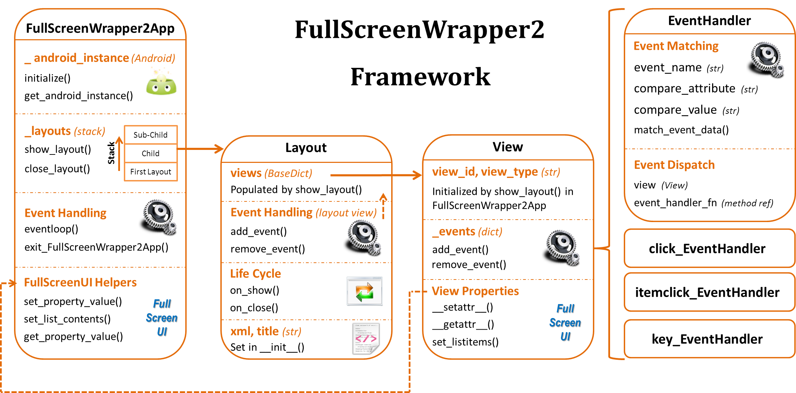
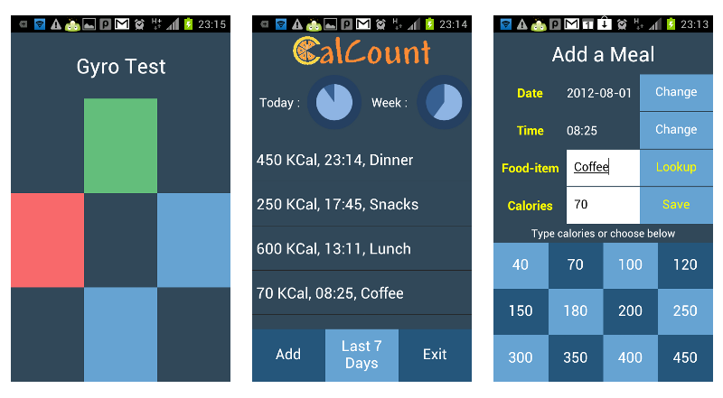

FullScreenWrapper2 Framework
===
A GUI Framework developing full screen apps using FullScreenUI API in SL4A

FullScreenWapper2 is a GUI Framework for developing full screen apps using the FullScreenUI API
functions provided by SL4A in Python. This lets you design a look & feel similar to Android Java
apps using the same XML Layouts and let you respond to View events.

It is a significant (non-backward compatible) enhancement over FullScreenWrapper that attempts to
make programming using FullScreenUI as simple as programming in standard GUI Frameworks.

Update: A working Python3 compatible version is now available - could do with more testing.

Features
---
* An FullScreenWrapper2App class that manages the eventloop & a layout stack enabling easy
  parent->child->parent transitions
* EventHandler classes with event-matching functions pre-built for standard View events like
  click,itemclick(ListView) and key
* Device Sensors & other similar SL4A/Custom events can also be caught & managed using the same
  eventloop + EventHandler class
* Object like access to a layout's views and properties (ie. MainLayout.views.txt_label.background = "#FFAA00AA")



Demo Screenshots
---


Download
---
You can find [FullScreenWrapper2 files](../sl4atools/fullscreenwrapper2/)
under the sl4atools directory in the Python for Android
repository.

1. [fullscreenwrapper2.py](../sl4atools/fullscreenwrapper2/fullscreenwrapper2.py)
   is the main file you need to import
2. _Update:_ A working [Python3 compatible version](../sl4atools/fullscreenwrapper2/py3/fullscreenwrapper2_py3.py)
   is now available - could do with more testing.
3. [API Docs](../../../releases/download/r17/fullscreenwrapper2_docs.zip)
   generated from docstrings are available
4. The following FullScreenWrapper2 examples are available
   * [Simple Demo](../sl4atools/fullscreenwrapper2/examples/fullscreenwrapper2demo/fullscreenwrapper2demo.py)
     to show basic usage of the Framework
   * [Gyroscope Sensor](../sl4atools/fullscreenwrapper2/examples/gyro_sl4a_test/gyro_sl4a_test.py)
     tilting example to show how FullScreenWrapper2 EventHandler classes can
     be used to catch SL4A events & use them in your User Interface
   * [A Full App (a calorie counter)](../../../releases/download/r17/fullscreenwrapper2_calcount2_example.zip)
     that has parent & child layouts, resources & layouts being
     loaded from files, database access etc.
5. A zip file with [everything](../../../releases/download/r17/fullscreenwrapper2_everything.zip)
   is available

How to Use Guide
---
### 1. Import fullscreenwrapper2 & define your layout class

First place fullscreenwrapper2.py in the same folder as your script. You start by importing
everything from fullscreenwrapper2 & inheriting a class for your own layout from the Layout class
and calling *init* function of Layout using *super* keyword with the XML Layout (string) and the
Screen Title (string).

```python
from fullscreenwrapper2 import *

class DemoLayout(Layout):
    def __init__(self):
        super(DemoLayout,self).__init__(xmldata,"FullScreenWrapper Demo")
```

### 2. Define on_show() and on_close() functions

The *on_show()* function is *very important* as your views become accessible through the
FullScreenWrapper2 framework *ONLY AFTER* on_show() is called by the framework. This is the place
where you initialize / set the values of your views & setup event handlers. If you're having
parent->child layouts, on_show() is also called when a child layout closes & the parent layout
comes back on.

Views & their properties can be accessed via *Layout.views.view_id.property*. In the example below,
we're setting the background color - most simple properties should work without a hitch.

Both the Layout & the individual Views can have events associated with them. You would typically
use *click_EventHandler* & *itemclick_EventHandlers* (for ListView) with Views. The init for these
take the View itself & an event handler function reference to call when the event occurs as
parameters.

You would typically associate *key_EventHandler* with the layout itself. The *init* for
key_EventHandler takes a key_match_id (defaults to "4" which is the back key), a view (defaults to
None) and an event handler function reference as parameters.

```python
    def on_show(self):
        self.add_event(key_EventHandler(handler_function=self.close_app))
        self.views.but_change.add_event(click_EventHandler(self.views.but_change,
self.change_color))
        self.views.but_exit.add_event(click_EventHandler(self.views.but_exit, self.close_app))
        self.views.txt_colorbox.background="#ffffffff"
```

For Sensor events like Gyroscope, you can directly use the EventHandler class - just set

You can access a view's properties Layout.views.view_id.property

```python
    def on_show(self):
        self.add_event(key_EventHandler(handler_function=self.close_app))
        self.views.but_change.add_event(click_EventHandler(self.views.but_change,
self.change_color))
        self.views.but_exit.add_event(click_EventHandler(self.views.but_exit, self.close_app))
        self.views.txt_colorbox.background="#ffffffff"
```

The on_close() is mainly allow you to save state before a layout dissappears if needed. You can
have *pass* as the only statement.

```python
    def on_close(self):
        pass
```

The restriction of views becoming accessible only after the framework calls on_show() of a layout
is because of the the way FullScreenUI works. You need to show a layout first before you can
access its views. FullScreenWrapper2 uses Android.fullGetProperty() to find out which views
contain an "id" and are available for access and creates & populates View objects in each layout's
views collection. These View objects let you associate events with them & allow you to access
properties through SL4A reflection using setattr() and getattr(). Layouts handle their events
through a special view added to the views collection.

### 3. Create your event handler functions & other functions

The event handler function definition signature should be as follows:

```python
    def event_handler_function(self,view,event):

Each event handler is passed a reference to the view with which the event is associated (can be
None) & the SL4A event data obtained from Android.eventPoll().result0. In the example below, every
time a button on screen is pressed, the textbox changes to a random color background.

```python
    def close_app(self,view,event):
        FullScreenWrapper2App.exit_FullScreenWrapper2App()

    def change_color(self,view, event):
        colorvalue =
"#ff"+self.get_rand_hex_byte()+self.get_rand_hex_byte()+self.get_rand_hex_byte()
        self.views.txt_colorbox.background=colorvalue
    
    def get_rand_hex_byte(self):
        j = random.randint(0,255)
        hexrep = hex(j)[2:]
        if(len(hexrep)==1):
            hexrep = '0'+hexrep   
        return hexrep 
```

### 4. Initialize FullScreenWrapper2, Show Layout & Execute eventloop

Once your layout class is setup, in your main function, initialize the framework first with
Android.Android(). Then show the layout using *FullScreenWrapper2App.show_layout()* and initiate the
eventloop().

```python
if __name__ == '__main__':
    droid = android.Android()
    random.seed()
    FullScreenWrapper2App.initialize(droid)
    FullScreenWrapper2App.show_layout(DemoLayout())
    FullScreenWrapper2App.eventloop()
```

### 5. Putting it together

The full code from above example is shown here to show how simple it all is. The full source code
[including the XML Layout](../sl4atools/fullscreenwrapper2/examples/fullscreenwrapper2demo/fullscreenwrapper2demo.py)
is also availble.

For simple XML layouts, you can just define layout in a string variable in your module. However,
as your apps become more complex, you may want to load from sdcard files or even the internet.

```python
import android, random
from fullscreenwrapper2 import *

class DemoLayout(Layout):
    def __init__(self):
        super(DemoLayout,self).__init__(xmldata,"FullScreenWrapper Demo")
        
    def on_show(self):
        self.add_event(key_EventHandler(handler_function=self.close_app))
        self.views.but_change.add_event(click_EventHandler(self.views.but_change,
self.change_color))
        self.views.but_exit.add_event(click_EventHandler(self.views.but_exit, self.close_app))
        self.views.txt_colorbox.background="#ffffffff"
        
    def on_close(self):
        pass
    
    def close_app(self,view,event):
        FullScreenWrapper2App.exit_FullScreenWrapper2App()

    def change_color(self,view, event):
        colorvalue =
"#ff"+self.get_rand_hex_byte()+self.get_rand_hex_byte()+self.get_rand_hex_byte()
        self.views.txt_colorbox.background=colorvalue
    
    def get_rand_hex_byte(self):
        j = random.randint(0,255)
        hexrep = hex(j)[2:]
        if(len(hexrep)==1):
            hexrep = '0'+hexrep   
        return hexrep 

if __name__ == '__main__':
    droid = android.Android()
    random.seed()
    FullScreenWrapper2App.initialize(droid)
    FullScreenWrapper2App.show_layout(DemoLayout())
    FullScreenWrapper2App.eventloop()
```

Attribution
---
This document is from "FullScreenWrapper2 Framework" by [srinathd...@gmail.com](https://code.google.com/u/113175150694318284068/)
is licensed under [Creative Commons Attribution 3.0 Unported License](http://creativecommons.org/licenses/by/3.0/deed.en_US).

Modifications by [Shimoda](emailto:kuri65536@hotmail.com)

* Format to markdown.


License
---
This work is open source & licensed under a
[Creative Commons Attribution 3.0 Unported License](http://creativecommons.org/licenses/by/3.0/deed.en_US).
This is a very permissive license & you're pretty much free to use & modify any way you want
(including commercial use) with attribution.


<!---
 vi: ft=markdown:et:ts=4:fdm=marker
 -->
